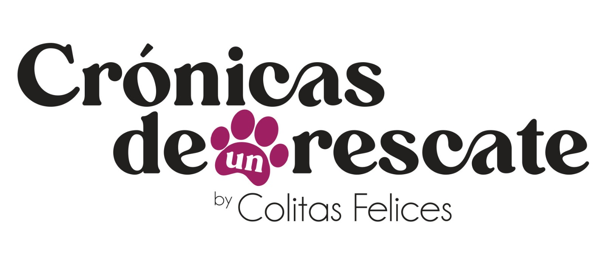

# Proyecto_web
## Este proyecto consiste en mostrar un prototipo digital en Figma con el fin de emplear algunas habilidades de diseño del layout de una apliacaión web.
## Se acrtualizo el proyecto con una codificiación en HTML, CSS y JS con el fin de crear un sitio web coidificado.
## El sitio web se llama Las Crónicas de un Rescate y se trata de un sitio donde los usuarios podrán hacer donaciones y adoptar mascotas en una organización civil de rescate animal.
## En la parte inferior se va a colocarlos avances de la codificación del archivo index.html de la página web. 

<!DOCTYPE html>
<html lang="en">
<head>
    <meta charset="UTF-8">
    <meta name="viewport" content="width=device-width, initial-scale=1.0">
    <title>Las Crónicas de un Rescate</title>
    <link rel="stylesheet" href="styles.css">
    <link href="https://cdn.jsdelivr.net/npm/bootstrap@5.2.3/dist/css/bootstrap.min.css" rel="stylesheet" integrity="sha384-rbsA2VBKQhggwzxH7pPCaAqO46MgnOM80zW1RWuH61DGLwZJEdK2Kadq2F9CUG65" crossorigin="anonymous">
</head>
<body>

  

<nav class="navbar navbar-expand-lg bg-body-tertiary sticky-top navbar1">
    

      
      <button class="navbar-toggler" type="button" data-bs-toggle="collapse" data-bs-target="#navbarSupportedContent" aria-controls="navbarSupportedContent" aria-expanded="false" aria-label="Toggle navigation">
        
      </button>
      

        <ul class="navbar-nav me-auto mb-2 mb-lg-0">
          <li class="nav-item">
            <a class="nav-link active" aria-current="page" href="#">Inicio</a>
          </li>
          <li class="nav-item">
            <a class="nav-link" href="#">Crónicas de un rescate</a>
          </li>
          <li class="nav-item dropdown">
            <a class="nav-link dropdown-toggle" href="#" role="button" data-bs-toggle="dropdown" aria-expanded="false">
              Dropdown
            </a>
            <ul class="dropdown-menu">
              <li><a class="dropdown-item" href="#">Action</a></li>
              <li><a class="dropdown-item" href="#">Another action</a></li>
              <li>
</li>
              <li><a class="dropdown-item" href="#">Something else here</a></li>
            </ul>
          </li>
          <li class="nav-item">
            <a class="nav-link disabled" aria-disabled="true">Disabled</a>
          </li>
        </ul>
        <form class="d-flex" role="search">
          <input class="form-control me-2" type="search" placeholder="Search" aria-label="Search">
          <button type="button" class="btn btn-dark">Buscar</button>
        </form>
      

    

  </nav>

    

      

      
      

      

      <h1>Un lugar en tu hogar.</h1>
      

    

    

      

      <h2>Tu puedes ayudar a salvar animales en situacion de calle hoy.</h2>

      
 Como Guardián de Las Crónicas de un Rescate, tu donación mensual 
          ayudará a los animales inocentes y descuidados que sienten que han 
          sido olvidados. Las Crónicas de un Rescate es líder en 
          rescate y protección animal, trabajando incansablemente durante 
          todo el año para poner fin a la crueldad animal. Ninguno de estos 
          trabajos sería posible sin personas compasivas como tú. 
          Gracias por tu apoyo.
      

      
 
        Las Crónicas de un Rescate lucha por salvar animales de peleas de perros, 
        criaderos de cachorros, acumulación y otras situaciones de crueldad. 
        Proporcionamos atención médica y rehabilitación conductual a los animales, 
        y ayudamos a miles de ellos a encontrar hogares amorosos cada año. Respondemos 
        a emergencias cuando ocurre un desastre, y luchamos legalmente para 
        proteger a los animales. 
        Cuando te conviertes en un Guardián de Las Crónicas de un Rescate, 
        tu donación mensual regular nos permite pasar menos tiempo recaudando 
        fondos y más tiempo salvando vidas.
     

      

      
      

      
      

     
    

  

</body>
</html>

##Este siguiente código es de los estilos de CSS: 

html {

font-size: 25px;
}
body {

background-color:white;
}

h1 {

font-style:italic;
font-family:Georgia;
text-align: left;
position: relative;
}

h2 {

    margin:20px;
    padding:40px;
    font-family:'Trebuchet MS', 'Lucida Sans Unicode', 'Lucida Grande', 'Lucida Sans', Arial, sans-serif;
    text-align: left;
}

.container {

justify-content:center;
align-items: center;

}

.nv1 {

position: relative;
bottom: 15px;
}

.picture1 {

width: 400px;
height: 180px;
margin-left: 300px;
position: relative;
right:300px;
top: 20px;

}

.picture2 {

width: 45px;
height: 40px;
}

.col1 {

height:250px;

}

.col2 {

justify-content:left;

}

.navbar1 {

background-color: white;
}
